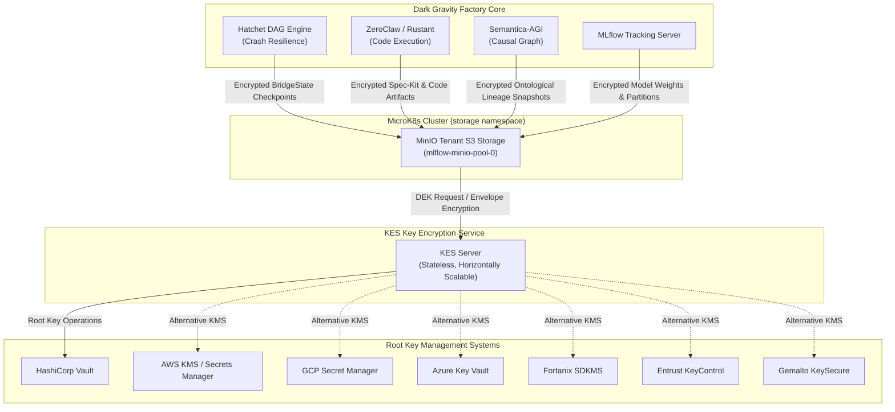
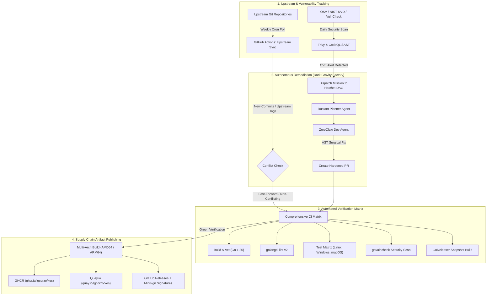

> [!NOTE]
> **UPSTREAM STATUS & FORK PURPOSE:**
> While upstream MinIO has archived the open-source KES (Key Encryption Service) in favor of proprietary MinKMS AiStor Key Manager, this repository is **actively maintained and hardened** as the cryptographic key management backbone of the **[Dark Gravity Autonomous CA/CD Factory](https://github.com/lgcorzo/rust_CACD_autonomous_factory)**. Ongoing security patches, envelope encryption hardening, and supply-chain integrity checks are continuously integrated to protect the autonomous software delivery lifecycle.

---

## 🛡️ Dark Gravity Factory: Security Maintenance & System Integrity Rationale

### 1. Why Security Maintenance Continues on this Repository

In the **Dark Gravity Autonomous CA/CD Software Factory (V7.2 / V7.3)**, KES is not merely a utility—it is the **critical Key Management Service (KMS) proxy** that governs all envelope encryption operations, data-at-rest protection, and cryptographic key lifecycle management for the entire autonomous engineering system.

Upstream MinIO's deprecation of KES open-source leaves unaddressed security vulnerabilities (CVEs) and orphaned cryptographic primitives. In a zero-trust, autonomous multi-agent factory where AI agents autonomously synthesize, compile, and deploy software:
- **Envelope Encryption Integrity**: KES mediates all Data Encryption Key (DEK) derivation between MinIO Object Storage and the root KMS (HashiCorp Vault, AWS KMS, GCP KMS, Azure Key Vault). Unpatched vulnerabilities in the key proxy would compromise every encrypted object in the factory.
- **Cryptographic Provenance Chain**: Every artifact produced by the Dark Gravity factory—compiled binaries, AST mutations, causal lineage snapshots—relies on KES-derived keys for at-rest encryption. A broken KES link invalidates the entire cryptographic proof chain.
- **Air-Gapped Data Sovereignty**: Dark Gravity operates on sovereign, air-gapped infrastructure. Key material must never escape the private network perimeter, and the KMS proxy must remain fully auditable and patchable without commercial dependencies.
- **Continuous Compliance & Auditability**: Under regulations like the **EU AI Act (Art. 12 & 14)**, **SOC 2 Type II**, and **ISO/IEC 25059**, any weakness in key management voids the factory's compliance posture.

Therefore, this repository is actively maintained to remediate security flaws, patch cryptographic vulnerabilities, and provide robust CI/CD builds tailored for production Kubernetes and MicroK8s environments.

---

### 2. Integration Architecture within Dark Gravity

KES is the central cryptographic gateway bridging MinIO Object Storage with enterprise Key Management Systems:



* **Cluster Topology & Service Endpoints**: KES is deployed as a stateless service in the `storage` Kubernetes namespace, fronting MinIO's Server-Side Encryption (SSE-S3/SSE-KMS) with horizontal auto-scaling.
* **Envelope Encryption Flow**: MinIO requests Data Encryption Keys (DEKs) from KES. KES derives DEKs using root keys stored in the configured KMS backend (Vault, AWS, GCP, Azure, etc.), returning both the plaintext DEK (for encryption) and the sealed DEK (for storage alongside encrypted data).
* **Stateless Architecture**: KES nodes maintain no persistent state—all key material is derived on-demand from the root KMS, enabling seamless scaling and zero-downtime upgrades.

---

### 3. Critical Security Mechanisms Enforced

To protect the factory's cryptographic infrastructure against compromise, the following defenses are strictly enforced:
- **mTLS Identity Verification**: All KES API access requires mutual TLS authentication. Client certificates are mapped to KES identities with policy-based access control.
- **Policy-Based Key Access Control**: Fine-grained policies restrict which identities can create, derive, decrypt, or list keys, preventing unauthorized key operations.
- **Audit Logging**: Every cryptographic operation (key creation, DEK derivation, decryption) is logged with full identity context for compliance audit trails.
- **Prometheus Metrics & Monitoring**: KES exposes `/v1/metrics` for real-time observability of cryptographic operations, error rates, and latency.
- **Cryptographic Provenance (NHI Verifiable Credentials)**: Every artifact and code modification is cryptographically signed by Non-Human Identities (NHI) using **W3C Verifiable Credentials** with **Ed25519** keys and deterministic BLAKE3/SHA-256 hashes.

---

<p align="center">
  
</p>

***

# KES Quickstart Guide

[](https://github.com/lgcorzo/kes/blob/master/LICENSE)

**KES is a cloud-native distributed key management and encryption server designed to secure modern applications at scale.**

 - [What is KES?](#what-is-kes)
 - [Installation](#install)
 - [Quick Start](#quick-start)
 - [Documentation](#docs)
 
## What is KES?

KES (Key Encryption Service) is a distributed key management server that scales horizontally. It can either be run as edge server close to the applications
reducing latency to and load on a central key management system (KMS) or as central key management service. KES nodes are self-contained
stateless instances that can be scaled up and down automatically.

<p align="center">
  
</p>

## KES is Open Source Software

We designed KES as Open Source software for the Open Source software community. We encourage the community to remix, redesign, and reshare KES under the terms of the AGPLv3 license.

All usage of KES in your application stack requires validation against AGPLv3 obligations, which include but are not limited to the release of modified code to the community from which you have benefited.

The AGPLv3 provides no obligation by any party to support, maintain, or warranty the original or any modified work.
All support is provided on a best-effort basis through GitHub, and any member of the community is welcome to contribute and assist others in their usage of the software.

## Install

The KES server and CLI is available as a single binary, container image or can be built from source.

<details open="true"><summary><b><a name="docker">Docker</a></b></summary>

Pull the latest release via:
```
docker pull lgcorzo/kes
```
</details>

<details><summary><b><a name="binary-releases">Binary Releases</a></b></summary>

| OS      | ARCH    | Binary                                                                                       |
|:-------:|:-------:|:--------------------------------------------------------------------------------------------:|
| linux   | amd64   | [linux-amd64](https://github.com/lgcorzo/kes/releases/latest/download/kes-linux-amd64)         |
| linux   | arm64   | [linux-arm64](https://github.com/lgcorzo/kes/releases/latest/download/kes-linux-arm64)         |
| darwin  | arm64   | [darwin-arm64](https://github.com/lgcorzo/kes/releases/latest/download/kes-darwin-arm64)       |
| windows | amd64   | [windows-amd64](https://github.com/lgcorzo/kes/releases/latest/download/kes-windows-amd64.exe) |

Download the binary via `curl` but replace `<OS>` and `<ARCH>` with your operating system and CPU architecture.
```
curl -sSL --tlsv1.2 'https://github.com/lgcorzo/kes/releases/latest/download/kes-<OS>-<ARCH>' -o ./kes
```
```
chmod +x ./kes
```

You can also verify the binary with [minisign](https://jedisct1.github.io/minisign/) by downloading the corresponding [`.minisig`](https://github.com/lgcorzo/kes/releases/latest) signature file. 
Run:
```
curl -sSL --tlsv1.2 'https://github.com/lgcorzo/kes/releases/latest/download/kes-<OS>-<ARCH>.minisig' -o ./kes.minisig
```
```
minisign -Vm ./kes -P RWTx5Zr1tiHQLwG9keckT0c45M3AGeHD6IvimQHpyRywVWGbP1aVSGav
```
</details>   
   
<details><summary><b><a name="build-from-source">Build from source</a></b></summary>

Download and install the binary via your Go toolchain:

```sh
go install github.com/lgcorzo/kes/cmd/kes@latest
```

</details>

## Quick Start
   
We run a public KES instance at `https://play.min.io:7373` as playground.
You can interact with our play instance either via the KES CLI or cURL.
Alternatively, you can get started by setting up your own KES server in
less than five minutes.
   
<details><summary><b>First steps</b></summary>

#### 1. Configure CLI
Point the KES CLI to the KES server at `https://play.min.io:7373` and use the following API key:
```sh
export KES_SERVER=https://play.min.io:7373
export KES_API_KEY=kes:v1:AD9E7FSYWrMD+VjhI6q545cYT9YOyFxZb7UnjEepYDRc
```

#### 3. Create a Key
Create a new root encryption key - e.g. `my-key`.
```
kes key create my-key
```
> Note that creating a new key will fail with `key already exist` if it already exist.

#### 4. Generate a DEK
Derive a new data encryption keys (DEK).
```sh
kes key dek my-key
```
The plaintext part of the DEK would be used by an application to encrypt some data.
The ciphertext part of the DEK would be stored alongside the encrypted data for future
decryption.

</details>   

## Docs

If you want to learn more about KES checkout our [documentation](https://min.io/docs/kes/).
 - [Integration Guides](https://github.com/lgcorzo/kes/wiki#supported-kms-targets)
 - [Command Line](https://min.io/docs/kes/cli/#available-commands)
 - [Server API](https://min.io/docs/kes/concepts/server-api/)
 - [Go SDK](https://pkg.go.dev/github.com/lgcorzo/kes-go)

### Monitoring

KES servers provide an API endpoint `/v1/metrics` that observability tools, like [Prometheus](https://prometheus.io/), can scrape.  
Refer to the [monitoring documentation](https://min.io/docs/kes/concepts/monitoring/) for how to setup and capture KES metrics.

For a graphical Grafana dashboard refer to the following [example](examples/grafana/dashboard.json).

  

## FAQs

<details><summary><b>I have received an <code>insufficient permissions</code> error</b></summary>
   
This means that you are using a KES identity that is not allowed to perform a specific operation, like creating or listing keys.

The KES [admin identity](https://github.com/lgcorzo/kes/blob/6452cdc079dfae54e4a46102cb4622c80b99776f/server-config.yaml#L8)
can perform any general purpose API operation. You should never experience a `not authorized: insufficient permissions`
error when performing general purpose API operations using the admin identity.

In addition to the admin identity, KES supports a [policy-based](https://github.com/lgcorzo/kes/blob/6452cdc079dfae54e4a46102cb4622c80b99776f/server-config.yaml#L77) access control model.
You will receive a `not authorized: insufficient permissions` error in the following two cases:
1. **You are using a KES identity that is not assigned to any policy. KES rejects requests issued by unknown identities.**
   
   This can be fixed by assigning a policy to the identity. Checkout the [examples](https://github.com/lgcorzo/kes/blob/6452cdc079dfae54e4a46102cb4622c80b99776f/server-config.yaml#L79-L88).
2. **You are using a KES identity that is assigned to a policy but the policy either not allows or even denies the API call.**
   
   In this case, you have to grant the API permission in the policy assigned to the identity. Checkout the [list of APIs](https://github.com/lgcorzo/kes/wiki/Server-API#api-overview).
   For example, when you want to create a key you should allow the `/v1/key/create/<key-name>`. The `<key-name>` can either be a
   specific key name, like `my-key-1` or a pattern allowing arbitrary key names, like `my-key*`.
   
   Also note that deny rules take precedence over allow rules. Hence, you have to make sure that any deny pattern does not
   accidentally matches your API request.

</details>   

---

### 4. Sovereign MinIO Ecosystem: Maintained Repositories in `@lgcorzo`

To guarantee long-term sovereign support, full supply-chain independence, and continuous security patching for the Dark Gravity factory and production environments, the complete MinIO ecosystem of 38 servers, clients, storage drivers, acceleration libraries, and core dependencies has been preserved and actively maintained under **`@lgcorzo`**:

| Category | Repository | Description | Key Capabilities |
| :--- | :--- | :--- | :--- |
| **Core Storage & Server** | [`lgcorzo/minio`](https://github.com/lgcorzo/minio) | High-performance Object Storage Server | Multi-tenant S3-compatible engine, Erasure Coding, Tiering, Decommissioning |
| | [`lgcorzo/mc`](https://github.com/lgcorzo/mc) | MinIO Client CLI Tool | High-speed mirror, diff, administration, encryption management, batch processing |
| | [`lgcorzo/kes`](https://github.com/lgcorzo/kes) | Key Encryption Server (KES) | High-performance KMS proxy (Vault, AWS-KMS, GCP-KMS, Azure Key Vault, Dev KMS) |
| | [`lgcorzo/console`](https://github.com/lgcorzo/console) | Graphical Web Administration Interface | Visual bucket policy management, IAM administration, observability metrics dashboard |
| | [`lgcorzo/operator`](https://github.com/lgcorzo/operator) | Kubernetes Operator | Declarative MinIO Tenant orchestration, CRD management, and cluster automation |
| | [`lgcorzo/directpv`](https://github.com/lgcorzo/directpv) | Kubernetes CSI Direct Storage Driver | High-throughput direct-attached NVMe/SSD volume provisioner for Kubernetes |
| | [`lgcorzo/sidekick`](https://github.com/lgcorzo/sidekick) | High-Performance S3 Proxy | Low-latency client-side load balancing and failover sidecar proxy |
| | [`lgcorzo/docs`](https://github.com/lgcorzo/docs) | Documentation Source & Engine | Sphinx-based documentation build system and architecture references |
| **SDKs & APIs** | [`lgcorzo/minio-go`](https://github.com/lgcorzo/minio-go) | Official Go Client SDK | Idiomatic Go SDK for object storage operations, multipart uploads, STS, and presigned URLs |
| | [`lgcorzo/madmin-go`](https://github.com/lgcorzo/madmin-go) | MinIO Admin Go Library | Administrative APIs for server configuration, user management, healing, and decommissioning |
| | [`lgcorzo/kms-go`](https://github.com/lgcorzo/kms-go) | Cryptographic KMS Client Library | Go client primitives for key creation, DEK derivation, and envelope encryption via KES |
| | [`lgcorzo/pkg`](https://github.com/lgcorzo/pkg) | Common Go Utility Packages | Cryptographic certificates, hashing routines, and shared helper primitives |
| | [`lgcorzo/mtls`](https://github.com/lgcorzo/mtls) | Mutual TLS Utilities | Zero-trust inter-node cryptographic identity verification and mTLS configuration |
| **Hardware & SIMD Acceleration** | [`lgcorzo/sha256-simd`](https://github.com/lgcorzo/sha256-simd) | SIMD-Accelerated SHA256 | AVX-512 and ARMv8 Crypto Extensions SHA256 acceleration (up to 100x speedup) |
| | [`lgcorzo/md5-simd`](https://github.com/lgcorzo/md5-simd) | SIMD-Accelerated MD5 | Parallel AVX-512 and AVX2 MD5 calculation (up to 8x acceleration) |
| | [`lgcorzo/blake2b-simd`](https://github.com/lgcorzo/blake2b-simd) | SIMD-Accelerated BLAKE2b | Pure Go cryptographic hashing leveraging AVX2/AVX512/SSSE3 vector instructions |
| | [`lgcorzo/highwayhash`](https://github.com/lgcorzo/highwayhash) | SIMD HighwayHash | High-speed native hashing (>10 GB/s per core on Intel & ARM assembly) |
| | [`lgcorzo/crc64nvme`](https://github.com/lgcorzo/crc64nvme) | NVMe CRC64 SIMD Acceleration | Fast carryless-multiplication CRC64 checksums for NVMe storage devices |
| | [`lgcorzo/simdjson-go`](https://github.com/lgcorzo/simdjson-go) | High-Throughput SIMD JSON Parser | Gigabytes/sec JSON parsing leveraging vector instructions for event & metadata processing |
| | [`lgcorzo/sio`](https://github.com/lgcorzo/sio) | Data At Rest Encryption (DARE) | Streaming authenticated encryption format for secure on-disk persistence |
| | [`lgcorzo/asm2plan9s`](https://github.com/lgcorzo/asm2plan9s) | Assembly Bytecode Converter | Converts AVX512/AVX2/ARM assembly instructions into Go Plan9 bytecode |
| **Networking & Routing** | [`lgcorzo/mux`](https://github.com/lgcorzo/mux) | High-Performance Request Router | Matcher and multiplexer for incoming S3 REST and STS API routes |
| | [`lgcorzo/websocket`](https://github.com/lgcorzo/websocket) | Low-Latency WebSocket Engine | High-throughput duplex communication for real-time console and bucket notifications |
| | [`lgcorzo/dnscache`](https://github.com/lgcorzo/dnscache) | DNS Lookup Caching | In-memory DNS cache minimizing latency on distributed multi-cluster lookups |
| **Data Formats & Helpers** | [`lgcorzo/zipindex`](https://github.com/lgcorzo/zipindex) | Fast ZIP Archive Indexer | Compressed index lookup enabling direct random reads of files inside ZIP archives |
| | [`lgcorzo/xxml`](https://github.com/lgcorzo/xxml) | Extended XML 1.0 Parser | Robust XML namespace and control character support for strict S3 API compliance |
| | [`lgcorzo/colorjson`](https://github.com/lgcorzo/colorjson) | Colorized JSON Encoder | Human-readable terminal logging and JSON inspection |
| | [`lgcorzo/csvparser`](https://github.com/lgcorzo/csvparser) | High-Performance CSV Parser | Streaming CSV parsing engine for S3 Select query execution |
| | [`lgcorzo/filepath`](https://github.com/lgcorzo/filepath) | Lexically Sorted Flat Path Walker | High-efficiency directory walking and flat object key enumeration |
| | [`lgcorzo/selfupdate`](https://github.com/lgcorzo/selfupdate) | Binary Self-Updating Library | Secure signature-verified self-upgrades for CLI binaries |
| | [`lgcorzo/cli`](https://github.com/lgcorzo/cli) | Minimalist CLI Framework | Lightweight command-line argument parser for distributed helper utilities |
| **Testing & Tooling** | [`lgcorzo/mint`](https://github.com/lgcorzo/mint) | Integration Test & Verification Suite | End-to-end multi-language test suite certifying S3 protocol and functional compliance |
| | [`lgcorzo/warp`](https://github.com/lgcorzo/warp) | S3 Benchmarking Tool | High-throughput synthetic benchmark suite measuring IOPS and latency |
| | [`lgcorzo/dperf`](https://github.com/lgcorzo/dperf) | Distributed Performance Benchmark | Stress-testing network bandwidth, disk I/O, and CPU throughput across storage nodes |
| | [`lgcorzo/certgen`](https://github.com/lgcorzo/certgen) | TLS Certificate Generator | Standalone zero-dependency x.509 TLS certificate generation utility |
| | [`lgcorzo/pkger`](https://github.com/lgcorzo/pkger) | Binary Packaging Utility | Multi-architecture DEB, RPM, and APK packaging automation tool |
| | [`lgcorzo/multipart-debug`](https://github.com/lgcorzo/multipart-debug) | S3 Multipart Upload Diagnostic Tool | Low-level multipart upload debugging, part alignment, and encryption validation |
| | [`lgcorzo/minio-cf`](https://github.com/lgcorzo/minio-cf) | Cloud Foundry Integration | Support for deploying and orchestrating MinIO within Cloud Foundry estates |

---

### 5. Sovereign Maintenance & Long-Term Support Plan in GitHub

To preserve long-term operational resilience, supply-chain autonomy, and enterprise security compliance (EU AI Act, SOC 2 Type II, ISO 25059) without upstream commercial lock-in, all 38 repositories are managed under a structured maintenance protocol:



#### 5.1 Automated Upstream Synchronization
- **Scheduled Synchronization Workflows**: Each repository runs a weekly GitHub Actions workflow fetching upstream tags and release commits.
- **Protected Branch Non-Destructive Merges**: Upstream changes are fetched into dedicated tracking branches and merged into `master` via pull requests to ensure custom factory hardening and Dark Gravity patches are never overwritten.

#### 5.2 Vulnerability Ingestion & Autonomous Remediation
- **Continuous CVE Scanning**: Daily VulnCheck, CodeQL, and govulncheck inspections are executed across all repositories.
- **Autonomous Repair via Dark Gravity Agents**:
  1. High/Critical CVEs trigger an issue labeled `autonomous-mission` in [`rust_CACD_autonomous_factory`](https://github.com/lgcorzo/rust_CACD_autonomous_factory).
  2. The Hatchet orchestrator assigns the remediation mission to **ZeroClaw** (developer agent).
  3. Surgical AST mutations are applied, tested in gVisor sandboxes against the standardized verification suite, and presented for Human-in-the-Loop (HITL) review.

#### 5.3 Multi-Architecture Container CI/CD & Local Registries
- **GoReleaser Multi-Arch Builds**: KES produces `linux/amd64` and `linux/arm64` binaries and container images via GoReleaser.
- **Dual Registry Target**:
  - Global Container Distribution: `ghcr.io/lgcorzo/kes:latest` and `quay.io/lgcorzo/kes:latest`.
  - Air-Gapped MicroK8s Deployments: In-cluster private registry at `localhost:32000`.

#### 5.4 Signature-Verified Binary Releases
- Every published binary (`kes`) is cryptographically signed using **Minisign**, generating signature files for supply-chain provenance verification.
- Downstream container images verify checksums before packaging to enforce strict supply-chain provenance.

#### 5.5 Go Module Dependency Resolution Policy
To import sovereign libraries across the Dark Gravity factory without namespace conflicts, projects declare Go module `replace` directives in their `go.mod`:

```go
module my-factory-service

go 1.25

require (
    github.com/minio/kes v0.0.0
    github.com/minio/kms-go/kes v0.3.1
)

replace (
    github.com/minio/kes => github.com/lgcorzo/kes master
    github.com/minio/kms-go => github.com/lgcorzo/kms-go master
)
```

---

## Contribute to KES Project

Please follow KES [Contributor's Guide](https://github.com/lgcorzo/kes/blob/master/CONTRIBUTING.md) for guidance on making new contributions to the repository.

## License

- KES source is licensed under the [GNU AGPLv3](https://github.com/lgcorzo/kes/blob/master/LICENSE).
- Use of `KES` is governed by the AGPLv3 license that can be found in the [LICENSE](./LICENSE) file.
